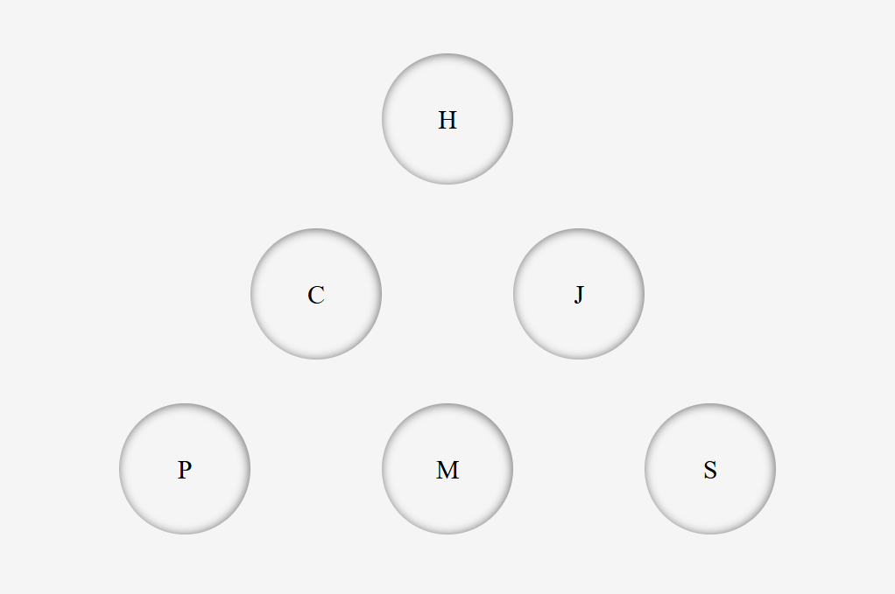

# Responsive & animated

Voici une activité individuelle en mode collaboratif qui porte exclusivement sur les langages HTML5 et CSS3.  
Le but est de vous familiariser avec le responsive design et l'animation.



```
▶️ Vous avez pour objectif :
    - d'afficher certaines lettres de vos nom/prénom en fonction de la taille d'affichage
    - de créer et d'afficher votre propre logo responsive en 3 versions
    - d'afficher votre logo dans l'onglet du navigateur
    - de créer des animations
```

## Contexte

Prenez connaissance du dossier models (screenshots depuis *Firefox*).  
Vous pouvez utiliser le navigateur de votre choix.

## Contraintes

- HTML5 et CSS3 uniquement
- vous ne pouvez ajouter du code qu'à certains endroits
- vous devez adapter le contenu du *h1* avec vos nom/prénom sans toucher aux balises *span*
- vous devez trouver le moyen d'afficher 2 espaces entre vos nom/prénom

Vous devez utiliser :
- le concept *mobile first* (focalisez-vous d'abord sur la version mobile)
- *flexbox* et *grid* pour le positionnement
- les *keyframes* pour les animations
- les *media queries* pour le *responsive design* (tablette & pc)
- *Font Awesome* pour les icônes
- des liens ancre avec défilement dynamique (mouvement visible)

Les tailles d'affichage correspondent à ces 3 types d'appareils (portrait et paysage) :
- "iPhone 6/7/8 iOS 11" (mobile)
- "iPad" (tablette)
- "720p HD Television" (pc)

La section 1 :
- les *div* mesurent 300x300px sur les 3 types d'appareils
- les *div* doivent toujours avoir un *margin* de 15px

La section 2 :
- les cercles mesurent 150px de diamètre
- ils ont toujours un *margin* de 15px
- une lettre au milieu d'une hauteur de 30px
- *"display: flex"* pour positionner les cercles en version mobile
- *"display: grid"* pour positionner les cercles en versions tablette et pc
- l'animation au survol des cercles se passe en 2 temps :
    * grossissement de 10% atteint au bout de 0.5s
    * puis une rotation de la lettre à 360° atteint au bout de 0.3s
- ensuite, le retour à la normale quand on "quitte le *hover*", dure 0.5s

Le pied de page :
- le *footer* fait 200px de hauteur

## Recommandations

- faites de l'indentation votre priorité
- prenez l'habitude de coder/commenter avec du vocabulaire anglais
- de bonnes pratiques à vérifier à l'aide de [W3C HTML](https://validator.w3.org/), [W3C CSS](https://jigsaw.w3.org/css-validator/) et [PageSpeed Insights](https://pagespeed.web.dev/?hl=fr)

## Livrables

Initialisez un nouveau dépôt privé sur GitHub.

Créer, en local, un nouveau dossier portant le même nom que votre dépôt et copiez :
- le fichier *index.html* (tel quel)
- le dossier css avec le fichier *style.css* (tel quel)

puis, faites votre 1er commit et push en l'état.  
Profitez-en pour m'inviter en tant que collaborateur 😉.  

Une fois votre *brief* terminé et votre **code vérifié**, faites un dernier commit *"finished"*.

## Authors

* [Nicolas Herbez](https://github.com/nicolas-herbez)
